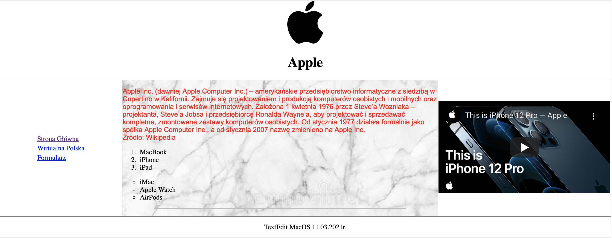

# zajecia-HTML

Repozytorium ze zbiorem zadań z zajęć z HTML'a i JavaScriptu

Celem projektu jest wykonanie kilku ćwiczeń, które mają stanowić wprowadzenie do HTML'a i JavaScriptu.

## Spis treści:
* [Pierwszy plik](#pierwszy-plik)
* [Drugi plik](#drugi-plik)
* [Trzeci plik](#trzeci-plik)
* [Status projektu](#status-projektu)

## Pierwszy plik 
Pierwszy plik zawiera stronę internetową, inspirowaną firmą Apple. 
Zawiera ona różne informacje o wspomnianej firmie, jak i przykładowy formularz do wypełnienia.

## Drugi plik
W drugim pliku znajduje się kod tworzący stronę internetową, w której skupiliśmy się na zajęciach na rozbudowaniu interaktywnego menu, z którego użytkownik może
wygodnie wybierać różne opcje, których w danej chwili poszukuje. 

## Trzeci plik
Trzeci pilk to zbiór czterech różnych skryptów.
 - Pierwszy to formularz, który wysyła użytkownikowi informację zwrotną, gdy nie wypełni któregoś pola, lub nie napisze imienia bądź nazwiska z wielkiej liery. Sprawdza on również poprawność znaków w określonych polach.
 - Drugi zajmuje się rozdzielaniem wprowadzonego przez użytkownika ciągu liczb pojedynczych, rozdzielaniu ich, a następnie porównywaniu. Jako komunikat zwrotny wyświetla największą z wprowadzonych liczb.
 - Trzeci 
 oblicza wartośc elementu ciągu Fibonacciego, wprowadzonego przez użytkownika. 
 - Czwarty 
 po wprowadzeniu dwóch liczb, liczy ich Największy Wspólny Dzielnik(NWD). Na podstawie zakodowanych funkcji skrypt przeprowadza określone operacje matematyczne, dzięki czemu jest w stanie wyświetlić prawidłowy wynik.

## Status projektu
 Projekt znajduje się w ciągłym rozwoju, w przyszłości zamierzam dodać więcej wykonanych zadań.

